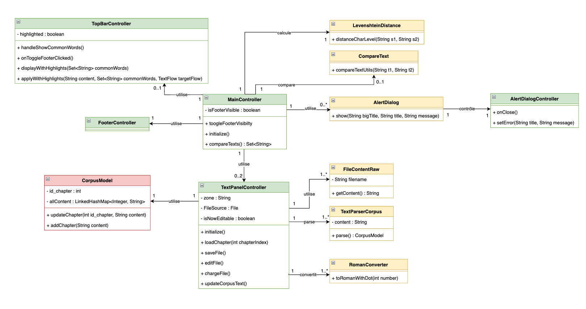

# Éditeur de corpus – README

Alan DELY - IAI1
---

## Prérequis
- JDK version 21

## Instructions d’installation 
Tout d'abord il faut télécharger le zip nommé AlanDelyProjetCorpusEditeur
```bash
unzip AlanDelyProjetCorpusEditeur
```
### Utilisation de makefile pour lancer le projet

```bash
cd AlanDelyProjetCorpusEditeur
make
```

### Commandes utilisés dans le MakeFile détaillées
#### Compilation

```bash
cd AlanDelyProjetCorpusEditeur
mkdir -p out
find src -name "*.java" > sources.txt
javac --module-path lib/ --add-modules javafx.controls,javafx.fxml -d out @sources.txt
rm sources.txt
```

#### Copie des fichiers FXML (équivalent de make resources)
```bash
mkdir -p out/view
cp src/view/*.fxml out/view/
```

#### Exécution 
```bash
java --module-path lib/ --add-modules javafx.controls,javafx.fxml -cp out src.App
```

### Modélisation

Le projet est modélisé à partir du Design Pattern **MVC** (Modèle-Vue-Contrôleur). Ce pattern permet de séparer clairement les responsabilités dans l'application :

* **Le Modèle** (`CorpusModel`) gère les données et la logique métier : il stocke les chapitres du corpus et fournit les méthodes de mise à jour ou d’ajout.
* **La Vue** est définie à l’aide de fichiers FXML, qui décrivent l’interface graphique sans logique de traitement.
* **Les Contrôleurs** (comme `MainController`, `TextPanelController`, etc.) font le lien entre l'interface graphique et le modèle : ils écoutent les événements utilisateur, manipulent le modèle et mettent à jour la vue.

Cette organisation rend le code plus modulaire, facile à maintenir et extensible.
Pour compléter la modélisation, des classes utilitaires indépendantes du modèle MVC ont été regroupées dans un dossier `helpers`. Elles permettent d’effectuer des traitements spécifiques ou techniques sans surcharger les contrôleurs.

Ci-dessous se trouve le diagramme UML de mon projet : 


### Tests

J'ai réalisé différents types de tests pour valider le bon fonctionnement de l'application.
Par exemple, pour la gestion des erreurs, j’ai mis en place une popup d’alerte. Pour vérifier son déclenchement, je testais manuellement en cliquant sur le bouton "Enregistrer" afin de m'assurer que la popup apparaissait bien en cas d'erreur.

Un autre scénario de test concernait la sauvegarde après modification : lorsque le même fichier était ouvert dans les deux panneaux, une modification effectuée dans un panneau était immédiatement visible dans l’autre, à condition d’être sur le même chapitre.

Enfin, j’ai réalisé de nombreux tests en utilisant des System.out.println() pour suivre le comportement des contrôleurs et m'assurer que chaque action utilisateur déclenchait bien la logique attendue, avant d’ajouter des fonctionnalités plus complexes.